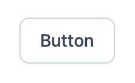
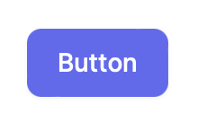
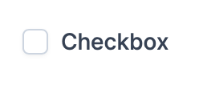
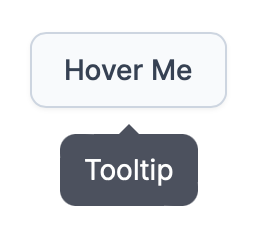
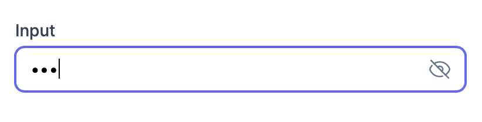
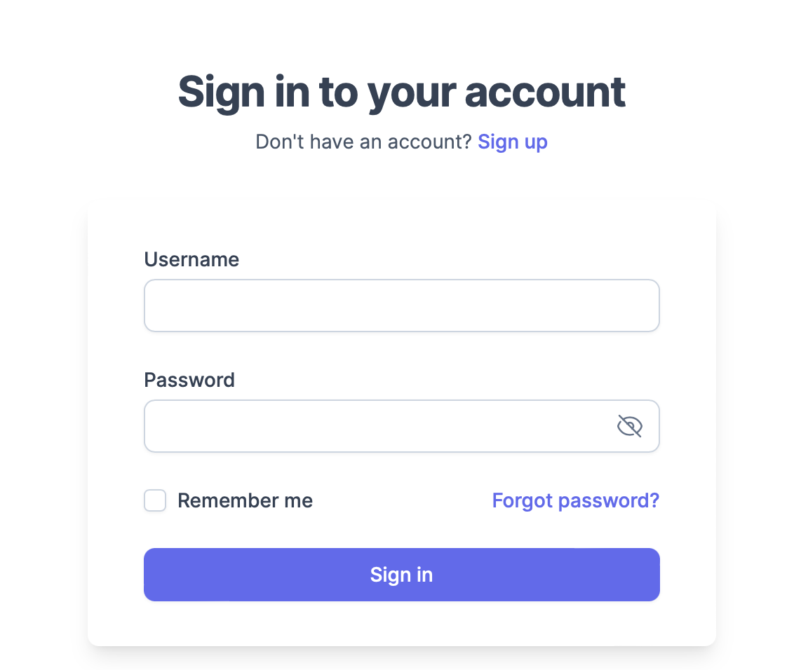
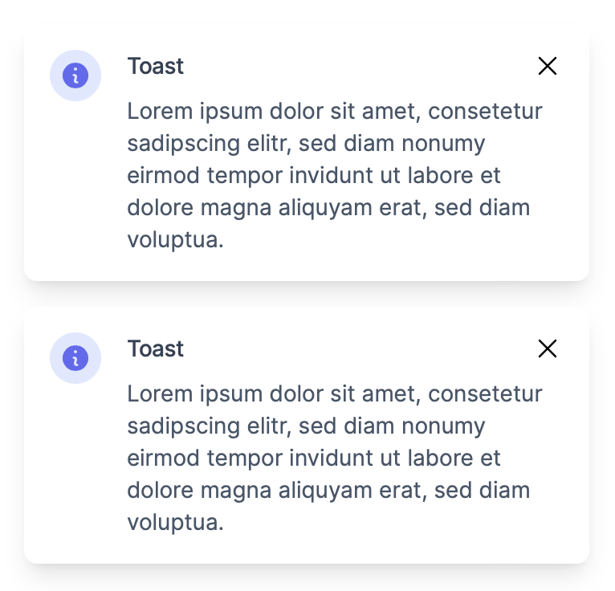
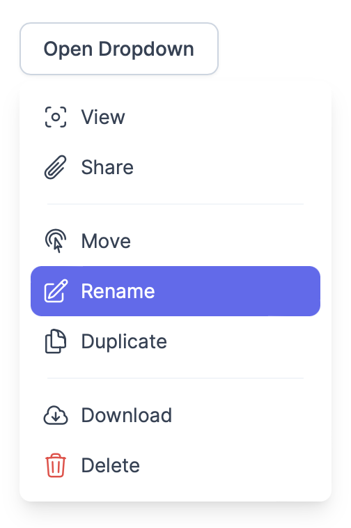
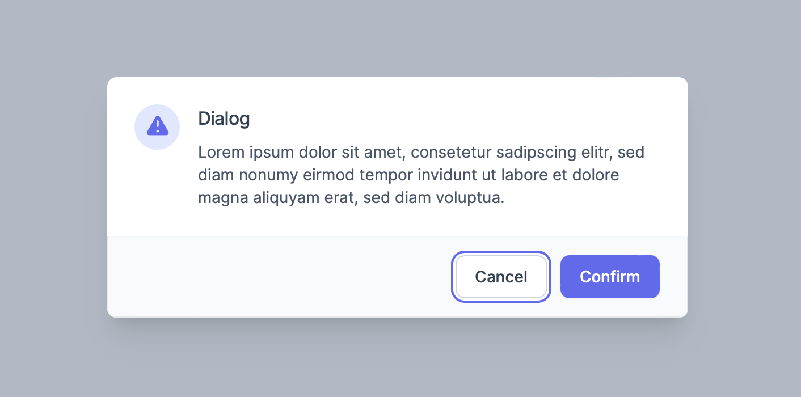

# twin-ui

Accessible React components for creating beautiful UIs. Built with Tailwind CSS, Radix UI, TypeScript, and React, this library provides simple, lightweight and easy-to-use components for building stunning UIs that are both beautiful and accessible.

Furthermore, it comes with pre-configured animations and offers pre-designed components, layouts, and pages, making it an ideal choice for getting your project up and running quickly.

## Images

<p align="center">









</p>

## Contents

**Components**

- Button
- Checkbox
- Dialog
- Drawer
- Dropdown
- Input
- Label
- Link
- Nav
- Spinner
- Text
- Title
- Toast
- Tooltip

**Layouts**

- Center

**Pages**

- SignIn
- NotFound
- Error

## Installation

To use `twin-ui`, install the package via npm.

```shell
npm install twin-ui

# or install a specific version
npm install twin-ui@x.x.x
```

To import the necessary styles, you have two options: either in the `index.tsx` file or the `index.css` file.

```typescript
// index.tsx
import 'twin-ui/dist/index.css';
```

```css
/* index.css */
@import 'twin-ui/dist/index.css';
```

## Examples

**Button**

```jsx
import { Button } from 'twin-ui';

const Component = () => (
  <Button color='primary' onClick={() => {...}}>
    Click
  </Button>
);
```

**Dialog**

```jsx
import { Dialogs, useDialog } from 'twin-ui';

const Component = () => {
  const dialog = useDialog();

  return (
    <Button onClick={() => dialog.open({...}))}>
      Click
    </Button>
  );
};

const App = () => {
  return (
    <>
      <Component />
      <Dialogs />
    </>
  );
}
```

**Center Layout**

```jsx
import { CenterLayout } from 'twin-ui';

const Component = () => (
  <CenterLayout>
    <div>Centered</div>
  </CenterLayout>
);
```
